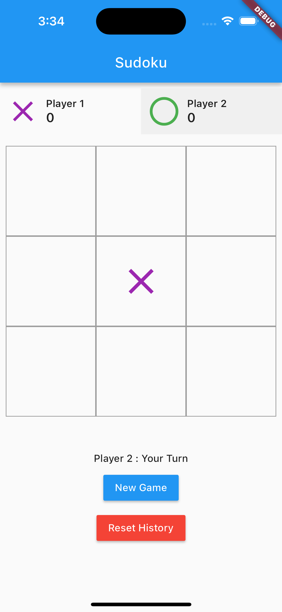
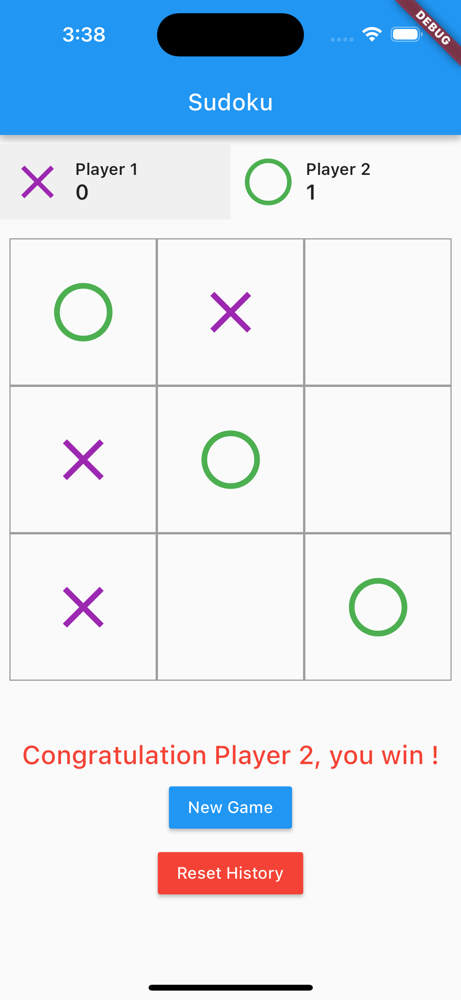
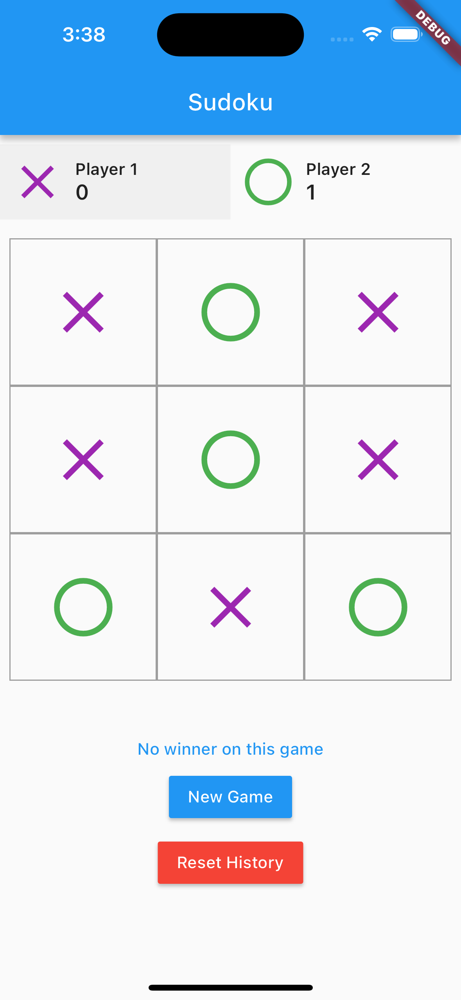

# Flutter Rayn Interview

## Goal
You will have to implement a tic-tac-toe game.
This test should not take more than 4 hours.

## Specifications
Below the list of requirements : 

    1. 2 players / 1 symbol by player
    2. Ability to start a new game
    3. Display the turn of the player
    4. At the end of the game, if there is a winner, add a point on player score and indicate the winner
    5. At the end of the game, if no winner just put a message to indicate that nobody win the game
    6. Display score of players
    7. Ability to reset the history
    8. Bonus : persist the game history in local storage

You can add other Flutter dependencies, but the existing ones are sufficient to complete the project.
The code have to be responsive.

## Screenshots

